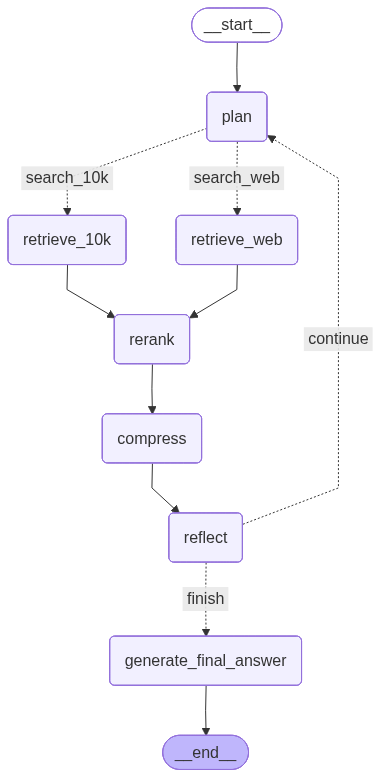

# 🧠 Advanced Deep Thinking RAG

A sophisticated multi-agent Retrieval-Augmented Generation (RAG) system that uses iterative reasoning, dynamic planning, and hybrid retrieval strategies to answer complex queries from financial documents and web sources.

[](https://www.python.org/downloads/)
[](https://fastapi.tiangolo.com/)
[](https://www.langchain.com/)
[](https://reactjs.org/)

---

## 📋 Table of Contents

- [Overview](#overview)
- [Features](#features)
- [Architecture](#architecture)
- [Installation](#installation)
- [Usage](#usage)
- [API Documentation](#api-documentation)
- [Evaluation Results](#evaluation-results)
- [Project Structure](#project-structure)
- [Configuration](#configuration)
- [Contributing](#contributing)
- [License](#license)

---

## 🎯 Overview

This project implements a **Deep Thinking RAG** system that significantly outperforms traditional RAG approaches by:

1. **Breaking down complex queries** into manageable sub-questions
2. **Dynamically selecting retrieval strategies** (vector, keyword, or hybrid search)
3. **Reranking and compressing** retrieved information
4. **Reflecting on findings** and deciding whether to continue research or finalize
5. **Streaming responses** in real-time to the frontend

The system is designed to answer multi-hop questions requiring information from both structured documents (SEC 10-K filings) and real-time web sources.

### Example Query

> *"Based on NVIDIA's 2025 10-K filing, identify their key risks related to competition. Then, find recent news from 2024 about AMD's AI chip strategy and explain how this new strategy directly addresses or exacerbates one of NVIDIA's stated risks."*

---

## ✨ Features

### Core Capabilities

- **🤖 Multi-Agent Architecture**: 6 specialized agents (Planner, Query Rewriter, Retrieval Supervisor, Distiller, Reflection, Policy)
- **🔍 Hybrid Retrieval**: Combines vector search (semantic) + BM25 (keyword) + metadata filtering
- **🎯 Intelligent Reranking**: Cross-encoder reranking for precision
- **🌐 Web Integration**: Tavily search for up-to-date information
- **📊 Streaming UI**: Real-time step-by-step visualization
- **📈 Evaluation Framework**: RAGAs metrics for performance tracking
- **⚡ Fast Startup**: Pre-built vector stores for instant deployment

### Technical Highlights

- **LangGraph** for stateful, iterative workflows
- **DeepSeek Reasoner** for complex planning and reasoning
- **Google Gemini Embeddings** for semantic search
- **Chroma DB** for persistent vector storage
- **FastAPI** with SSE (Server-Sent Events) streaming
- **React + Tailwind CSS** frontend

---

## 🏗️ Architecture


## Demo


### Agent Responsibilities

| Agent | Purpose |
|-------|---------|
| **Planner** | Decomposes complex query into sequential sub-questions |
| **Query Rewriter** | Optimizes sub-questions for retrieval |
| **Retrieval Supervisor** | Selects best strategy (vector/keyword/hybrid) |
| **Distiller** | Compresses retrieved context into concise summaries |
| **Reflection** | Generates key findings for each step |
| **Policy** | Decides whether to continue research or finalize |

---

## 🚀 Installation

### Prerequisites

- Python 3.10+
- Node.js 18+
- API Keys:
  - DeepSeek API Key
  - Google Gemini API Key
  - Tavily API Key

### Backend Setup

```bash
# Clone the repository
git clone https://github.com/yourusername/advanced-deepthinking-rag.git
cd advanced-deepthinking-rag/backend

# Create virtual environment
python -m venv rag
source rag/bin/activate  # On Windows: rag\Scripts\activate

# Install dependencies
pip install -r requirements.txt

# Create .env file
cat > .env << EOF
DEEPSEEK_API_KEY=your_deepseek_key_here
GOOGLE_API_KEY=your_gemini_key_here
TAVILY_API_KEY=your_tavily_key_here
EOF

# Build vector stores (one-time setup)
python build_vector_store.py

# Start the server
uvicorn server:app --reload --host 0.0.0.0 --port 8000
```

### Frontend Setup

```bash
cd ../frontend

# Install dependencies
npm install

# Start development server
npm start
```

The application will be available at:
- **Frontend**: http://localhost:3000
- **Backend API**: http://localhost:8000
- **API Docs**: http://localhost:8000/docs

---

## 💻 Usage

### 1. Web Interface

Navigate to `http://localhost:3000` and enter your query. The interface shows:

- **Planning Phase**: Multi-step research plan
- **Research Steps**: Real-time retrieval and findings
- **Final Answer**: Comprehensive response with citations

### 2. API Usage

#### Baseline RAG (Simple)

```bash
curl -X POST http://localhost:8000/query/baseline \
  -H "Content-Type: application/json" \
  -d '{"query": "What are NVIDIA'\''s key risks?"}'
```

#### Deep Thinking RAG (Streaming)

```bash
curl -X POST http://localhost:8000/stream_query/deep_thinking \
  -H "Content-Type: application/json" \
  -d '{"query": "Analyze NVIDIA'\''s competitive risks and AMD'\''s response"}' \
  --no-buffer
```

### 3. Python Client

```python
import requests
import json

query = "Your complex query here"

# Streaming response
with requests.post(
    "http://localhost:8000/stream_query/deep_thinking",
    json={"query": query},
    stream=True
) as response:
    for line in response.iter_lines():
        if line:
            data = json.loads(line.decode('utf-8')[5:])  # Remove 'data:' prefix
            
            if data["type"] == "plan":
                print("📋 Research Plan:", data["data"])
            elif data["type"] == "step_result":
                print(f"✅ Step {data['data']['step']}: {data['data']['summary']}")
            elif data["type"] == "final_answer":
                print("🎯 Final Answer:", data["data"])
```

---

## 📡 API Documentation

### Endpoints

#### `GET /`
Health check endpoint.

**Response**: `{"message": "Deep Thinking RAG API is running."}`

---

#### `POST /query/baseline`
Execute simple baseline RAG query.

**Request Body**:
```json
{
  "query": "What are the main risks in the 10-K?"
}
```

**Response**:
```json
{
  "baseline_output": "The main risks include...",
  "contexts": ["Context chunk 1...", "Context chunk 2..."]
}
```

---

#### `POST /stream_query/deep_thinking`
Execute Deep Thinking RAG with streaming.

**Request Body**:
```json
{
  "query": "Complex multi-hop question"
}
```

**Response** (Server-Sent Events):
```
data: {"type": "plan", "data": [...]}

data: {"type": "step_result", "data": {"step": 1, "sub_question": "...", "summary": "..."}}

data: {"type": "final_answer", "data": "Comprehensive answer..."}

data: {"type": "contexts", "data": ["Context 1...", "Context 2..."]}
```

---

## 📊 Evaluation Results

Performance comparison using RAGAs metrics:

| Metric | Baseline RAG | Deep Thinking RAG | 
|--------|--------------|-------------------|
| **Faithfulness** | 43.9% | **85.7%** | 
| **Context Recall** | 0.0% | **50.0%** | 
| **Context Precision** | 0.0% | **13.3%** | 
| **Answer Correctness** | 41.2% | **44.5%** | 

### Running Evaluation

```bash
# Ensure server is running
uvicorn server:app --reload

# In another terminal
python evaluate.py
```

Results are saved to `evaluation_results.csv`.

---

## 📁 Project Structure

```
advanced-deepthinking-rag/
├── backend/
│   ├── agents.py                 # Agent definitions (Planner, Rewriter, etc.)
│   ├── build_vector_store.py     # Offline vector store builder
│   ├── config.py                 # Configuration settings
│   ├── data_processing.py        # Document parsing and chunking
│   ├── evaluate.py               # RAGAs evaluation script
│   ├── graph_builder.py          # LangGraph construction
│   ├── graph_nodes.py            # Node functions for the graph
│   ├── main.py                   # CLI execution script
│   ├── models.py                 # Pydantic models
│   ├── rag_core.py               # Core RAG logic
│   ├── retrieval.py              # Retrieval strategies
│   ├── server.py                 # FastAPI server
│   ├── utils.py                  # Helper utilities
│   ├── vector_store.py           # Vector store management
│   ├── requirements.txt          # Python dependencies
│   ├── .env                      # Environment variables
│   ├── chroma_db/               # Persistent vector stores
│   │   ├── baseline/
│   │   ├── advanced/
│   │   └── bm25_index.pkl
│   └── data/                    # Downloaded documents
│       ├── nvda_q2_2025_clean.txt
│       └── nvda_q2_2025_raw.html
│
├── frontend/
│   ├── src/
│   │   ├── App.js               # Main React component
│   │   ├── App.css              # Styles
│   │   ├── index.js             # Entry point
│   │   └── reportWebVitals.js   # Performance monitoring
│   ├── public/
│   │   └── index.html
│   ├── package.json
│   └── tailwind.config.js
│
└── README.md
```

---

## ⚙️ Configuration

Edit `backend/config.py` to customize:

```python
config = {
    "data_dir": "./data",
    "vector_store_dir": "./vector_store",
    "persistent_db_dir": "./chroma_db",
    "reasoning_llm": "deepseek-reasoner",      # LLM for planning
    "fast_llm": "deepseek-chat",               # LLM for quick tasks
    "embedding_model": "models/gemini-embedding-001",
    "reranker_model": "cross-encoder/ms-marco-MiniLM-L-6-v2",
    "max_reasoning_iterations": 7,             # Max research steps
    "top_k_retrieval": 10,                     # Docs to retrieve
    "top_n_rerank": 3,                         # Docs after reranking
}
```

---

## 🐳 Docker Deployment (Optional)

```dockerfile
# Dockerfile (create this)
FROM python:3.10-slim

WORKDIR /app

COPY backend/requirements.txt .
RUN pip install --no-cache-dir -r requirements.txt

COPY backend/ .

EXPOSE 8000

CMD ["uvicorn", "server:app", "--host", "0.0.0.0", "--port", "8000"]
```

```bash
# Build and run
docker build -t deep-thinking-rag .
docker run -p 8000:8000 --env-file backend/.env deep-thinking-rag
```


## 🔧 Troubleshooting

### Common Issues

**Issue**: `ModuleNotFoundError: No module named 'langchain_deepseek'`
```bash
pip install langchain-deepseek
```

**Issue**: Vector stores not found
```bash
# Rebuild vector stores
python build_vector_store.py
```

**Issue**: Timeout errors during evaluation
```python
# In evaluate.py, increase timeout
eval_llm = ChatDeepSeek(model="deepseek-chat", timeout=300)
```

**Issue**: CORS errors in frontend
```javascript
// In server.py, ensure CORS middleware is configured
app.add_middleware(
    CORSMiddleware,
    allow_origins=["http://localhost:3000"],
    allow_credentials=True,
    allow_methods=["*"],
    allow_headers=["*"],
)
```

---

## 📚 References

- [LangChain Documentation](https://python.langchain.com/)
- [LangGraph Documentation](https://langchain-ai.github.io/langgraph/)
- [RAGAs Framework](https://github.com/explodinggradients/ragas)
- [DeepSeek API](https://platform.deepseek.com/)
- [Tavily Search API](https://tavily.com/)

---

## 👨‍💻 Author

**Siddhant Diwaker**
- GitHub: [@proxi666](https://github.com/proxi666)
- Docker: [@proxi666](https://hub.docker.com/u/proxi666)
- Email: siddhantdiwaker.sd@gmail.com

---

## 🙏 Acknowledgments

- NVIDIA for providing publicly available 10-K filings
- The LangChain and LangGraph teams for excellent frameworks
- The open-source community for various tools and libraries
- Fareed Khan for the original DeepRAG architecture and inspiration

---


**Built with ❤️ using LangChain, LangGraph, and FastAPI**
